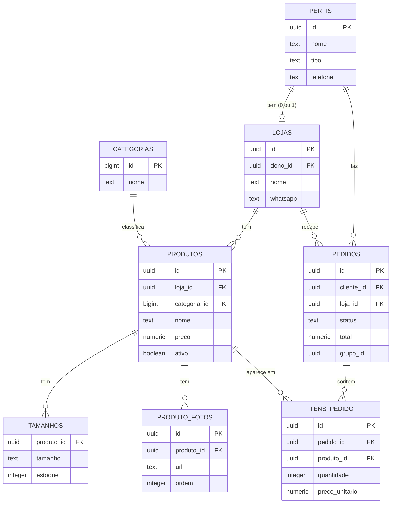

# Aula 44 – Documentação técnica: README, diagrama ER e instruções de uso

**Dia 15 · Ter 27/10/2026** · **Aula 44** · **UC3**

- **Requisitos cobertos:** não se aplica (documentação do projeto)
- **Tempo:** 10 minutos de abertura, 40 de prática e 10 de fechamento (60 minutos)
- **Ponto de partida:** sistema publicado no GitHub Pages, com o Supabase configurado para o endereço publicado (Aula 43); README.md simples criado na Aula 2

> Se você não terminou a aula anterior, refaça os passos dela (estão na seção Mão na Massa) antes de começar esta.

## Objetivo da aula

Em 60 minutos você vai escrever a **documentação técnica** do projeto no `README.md`: o que é, as **tecnologias**, **como rodar** no computador, **como configurar o Supabase**, a **lista das telas**, o **diagrama ER** das 8 tabelas e as **instruções de uso** para a cliente e a lojista.

**Abertura (10 minutos).** Retomada da Aula 43: o sistema está no ar. Imagine que, daqui a seis meses, uma pessoa nova na equipe (ou você mesma) abre o repositório. Sem documentação, ela leva horas para entender o que o projeto faz e como colocá-lo para rodar. O `README.md` é a **primeira página** que ela vê. Hoje ele deixa de ser um rascunho e vira o **manual** do projeto.

## O Conceito

**Termos desta aula**

- **README**: o arquivo de apresentação do repositório. O GitHub o mostra logo abaixo da lista de arquivos. É escrito em **Markdown** (`#` para títulos, `-` para listas, crases para `código`).
- **Documentação técnica**: o texto que explica **para quem desenvolve** como o projeto é feito e como configurá-lo (tecnologias, passo a passo de instalação, estrutura).
- **Diagrama ER (entidade-relacionamento)**: um desenho das **tabelas** do banco e das **ligações** entre elas.
- **Mermaid**: uma forma de escrever diagramas **como texto** dentro do README. O GitHub transforma o texto em desenho automaticamente.

**Analogia:** o README é o **manual de instruções da caixa**: diz o que tem dentro, como montar e como usar. Sem ele, quem recebe a caixa precisa adivinhar.

**Regra:** a documentação diz a **verdade**: cada passo escrito precisa funcionar. Quem escreve deve **seguir o próprio passo a passo** e conferir.

## Mão na Massa

### Passo 1: escreva o README

Substitua **todo o conteúdo** do `README.md`. Depois de colar, **troque** `SEU-USUARIO` pelo seu usuário do GitHub e escreva o **nome de cada integrante** da equipe na lista.

**Arquivo: `README.md`** (arquivo inteiro: apague todo o conteúdo atual e cole este)

````markdown
# VitrineCol

Plataforma web de **moda local** feita no curso **Jovem Programadora (Senac)**.

A cliente filtra roupas por tipo, tamanho e loja, junta peças de lojas diferentes na mesma sacola e faz **um pedido por
loja**, combinado pelo WhatsApp. Ela acompanha o status no sistema. A lojista cadastra a loja e os produtos (até 5 fotos cada)
e atualiza os pedidos. Pagamento e entrega ficam fora do MVP.

**Endereço do site publicado:** https://SEU-USUARIO.github.io/vitrine-col/ (troque pelo endereço da sua equipe)

## Integrantes da equipe

- Nome da primeira integrante
- Nome da segunda integrante

## Tecnologias

- HTML5, CSS3 e JavaScript puros, com módulos ES (`<script type="module">`). Sem frameworks e sem etapa de build.
- Supabase (banco PostgreSQL com regras de acesso por linha, login e armazenamento de fotos), usado pelo navegador com a
  biblioteca `supabase-js`, carregada por CDN.
- Git e GitHub; hospedagem estática no GitHub Pages; Live Server e DevTools para desenvolver e depurar.

## Como rodar no seu computador

1. Instale o VS Code com a extensão **Live Server** e o Git.
2. Clone o repositório e abra a pasta no VS Code:

   ```bash
   git clone https://github.com/SEU-USUARIO/vitrine-col.git
   ```

3. Preencha o arquivo `js/config.js` com o endereço e a chave **pública** (`anon`) do seu projeto Supabase (veja a próxima seção).
4. Clique em **Go Live** no VS Code. O site abre em `http://127.0.0.1:5500`.

## Como configurar o Supabase

1. Crie um projeto em https://supabase.com (plano gratuito).
2. No **SQL Editor**, rode os scripts da pasta `database/` **nesta ordem**:
   1. `01_schema.sql`: as 8 tabelas, os índices e os gatilhos;
   2. `03_seed.sql`: as 8 categorias (primeira parte) e, se quiser dados de exemplo, a loja e os 3 produtos (segunda parte, depois de criar uma lojista em **Authentication**);
   3. `02_rls.sql`: liga as regras de acesso (RLS) e cria o bucket de fotos;
   4. `04_melhorias.sql`: a função `criar_pedidos`, o fluxo de status, a exclusão de conta e os limites do bucket.
3. No painel, abra **Authentication** (em português: **Autenticação**) e **URL Configuration** (em português: **Configuração de URL**): informe o endereço do site (Site URL) e o de `recuperar-senha.html` (Redirect URLs).
   Durante os testes, a confirmação de e-mail pode ficar desligada; ligue-a se abrir o site para usuárias reais.
4. Em **Project Settings** (em português: **Configurações do projeto**), na parte **API**, copie o **Project URL** e a chave **anon / public** para o `js/config.js`.
   **Nunca** coloque a chave `service_role` no código.

## Telas do sistema

| Arquivo | Tela | Quem acessa |
| --- | --- | --- |
| `index.html` | Página inicial (vitrine) | Todos |
| `catalogo.html` | Catálogo com filtros e páginas | Todos |
| `loja.html` | Página da loja | Todos |
| `produto.html` | Página do produto, com galeria | Todos |
| `sacola.html` | Sacola por loja e finalização | Todos (finalizar exige login de cliente) |
| `login.html` e `cadastro.html` | Entrar e cadastrar | Visitantes |
| `recuperar-senha.html` | Recuperar a senha por e-mail | Todos |
| `privacidade.html` | Aviso de privacidade | Todos |
| `minha-conta.html` | Dados da conta e exclusão da conta | Cliente e lojista |
| `meus-pedidos.html` | Pedidos da cliente e avisos de status | Cliente |
| `painel-loja.html` | Minha loja | Lojista |
| `painel-produtos.html` e `painel-produto-form.html` | Meus produtos e formulário de produto | Lojista |
| `painel-pedidos.html` | Pedidos recebidos | Lojista |

(As telas de conta, de pedidos da cliente e de pedidos recebidos entram nas aulas do Dia 26.)

## Diagrama das tabelas



## Como usar

**Cliente**

1. Abra o catálogo e filtre por tipo de roupa, tamanho e loja (ou busque pelo nome).
2. Abra um produto, escolha o tamanho e a quantidade e clique em **Adicionar à sacola**. Você pode juntar peças de lojas diferentes.
3. Abra a **Sacola**, confira os subtotais por loja e clique em **Finalizar sacola** (é preciso estar logada como cliente).
4. Para cada loja aparece um botão de WhatsApp com o resumo do pedido: combine pagamento e entrega com a loja.

**Lojista**

1. Cadastre-se com o perfil **Lojista** e abra **Painel** > **Minha loja** para cadastrar a loja (nome, endereço, cidade e WhatsApp).
2. Em **Meus produtos**, clique em **Cadastrar produto**: informe nome, categoria, preço, tamanhos com estoque e até 5 fotos (a primeira é a capa).
3. Use **Desativar** para tirar um produto do catálogo e **Excluir** só para produtos que nunca foram pedidos.

## Regras importantes

- O preço é maior que zero e o estoque nunca é negativo; a quantidade mínima de um item é 1.
- Cada lojista tem no máximo uma loja; o perfil (cliente ou lojista) não muda depois do cadastro.
- Os pedidos só são gravados pela função `criar_pedidos()` do banco, que calcula o total e confere o preço.
- Nenhum dado vindo do banco ou da usuária entra na página com `innerHTML`.
````


### Passo 2: veja o resultado no GitHub

1. Salve e faça o commit (Passo 4) e o `git push`.
2. No GitHub, abra a página principal do repositório e confira: o título, as listas, as tabelas e o **diagrama das tabelas**, desenhado com caixas e linhas.
3. No VS Code, o painel de pré-visualização do Markdown (**Ctrl+Shift+V**, no Mac Cmd+Shift+V) mostra o texto formatado, mas **não** desenha o diagrama (só o GitHub desenha o Mermaid).

### Passo 3: confira a documentação seguindo o passo a passo

1. **Peça a uma colega** que **não participou** da escrita para seguir "Como rodar no seu computador" e "Como configurar o Supabase" **só com o README**, em outra pasta (clone o repositório em outro lugar). Anote onde ela travou.
2. Confira a tabela de **Telas do sistema** com os arquivos reais da raiz do projeto: cada arquivo citado existe? (As telas de conta, de pedidos da cliente e de pedidos recebidos só existem depois do Dia 26: o README já avisa.)
3. Conferir o diagrama: as 8 tabelas e as ligações batem com o que você criou no `01_schema.sql`?
4. Corrija o README com o que a colega apontou.

### Passo 4: faça o commit da aula

```bash
git add .
git commit -m "Escreve o README completo com tecnologias, configuração, telas e diagrama ER"
git push
```

## Explicação do Código

Em um README, cada seção responde a uma pergunta de quem chega:

- **Título e primeiro parágrafo:** "o que é isto?" Em três frases a pessoa entende o problema e o que o sistema faz. O endereço do **site publicado** vem logo no topo.
- **Integrantes:** quem fez (e quem pode responder dúvidas).
- **Tecnologias:** "do que é feito?" Útil para quem vai mexer: sem frameworks, sem etapa de build, Supabase.
- **Como rodar no seu computador:** os passos mínimos, na ordem: instalar, clonar, preencher o `config.js`, abrir com **Go Live**.
- **Como configurar o Supabase:** a ordem dos scripts SQL **importa** (`01_schema.sql`, depois o começo do `03_seed.sql`, depois `02_rls.sql` e por fim `04_melhorias.sql`), e as configurações do painel (URL, chaves). O aviso "**Nunca** coloque a chave `service_role` no código" é o mais importante.
- **Telas do sistema:** uma tabela com o arquivo, o nome da tela e **quem acessa**: é o mapa do sistema.
- **Diagrama ER em Mermaid:** o bloco de código com a palavra `mermaid` depois das três crases. `erDiagram` diz que é um diagrama de entidades. `PERFIS ||--o| LOJAS` lê-se "um perfil tem **zero ou uma** loja" (`||` = exatamente um, `o|` = zero ou um, `o{` = zero ou muitos). Cada tabela lista as colunas principais, com `PK` (chave primária) e `FK` (chave estrangeira).
- **Como usar:** instruções para a **cliente** e para a **lojista**, em passos curtos, na linguagem de quem usa (não de quem programa).
- **Regras importantes:** as regras de negócio que o sistema sempre respeita, para quem for mexer não quebrá-las.

## Validação

1. O README no GitHub mostra todas as seções, com tabelas e o **diagrama** desenhado.
2. O endereço do site publicado e os nomes das integrantes estão corretos.
3. Uma colega seguiu "Como rodar" e "Como configurar o Supabase" só com o README e chegou ao sistema funcionando.
4. A lista de telas bate com os arquivos reais do projeto.

**Erros comuns**

1. *Sintoma:* o diagrama aparece como texto, e não como desenho. *Causa:* o bloco não usa três crases com a palavra `mermaid` logo depois (`` ```mermaid ``). *Correção:* confira a abertura e o fechamento do bloco.
2. *Sintoma:* o diagrama mostra "Syntax error". *Causa:* um erro de digitação no Mermaid (por exemplo, falta uma chave `}` ou aspas). *Correção:* compare com o diagrama da aula, linha por linha.
3. *Sintoma:* as listas numeradas saem bagunçadas. *Causa:* falta de recuo (os itens internos precisam de 3 espaços). *Correção:* alinhe os itens como no exemplo.
4. *Sintoma:* a colega não conseguiu seguir o passo a passo. *Causa:* um passo estava faltando ou fora de ordem. *Correção:* acrescente o passo que ela precisou e refaça o teste.

**Se travar**

1. Abra o preview do README no GitHub (aba do arquivo) e compare com o texto.
2. Use o botão **Preview** (em português: **Visualização**) na tela de edição do GitHub para ver o Markdown formatado.
3. Se estragou o arquivo, volte ao último commit com `git restore README.md`.
4. Só depois peça ajuda à sua equipe.

**Seu projeto agora tem**

- Um `README.md` completo, com tecnologias, passo a passo, telas, diagrama ER e manual de uso.
- O mesmo projeto das aulas anteriores (nada mudou no código).

**Como saber que deu certo:** uma pessoa que nunca viu o projeto consegue colocá-lo para rodar seguindo só o README.
