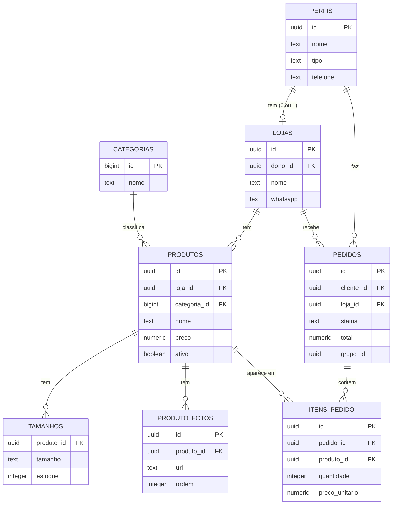

# Aula 84 – Documentação final e congelamento da versão 1.0

**Dia 28 · Seg 16/11/2026** · **Aula 84** · **UC6**

- **Requisitos cobertos:** não se aplica (documentação e entrega da versão 1.0)
- **Tempo:** 10 minutos de abertura, 40 de prática e 10 de fechamento (60 minutos)
- **Ponto de partida:** segurança revisada e versão final publicada (Aula 83); README da Aula 44; docs/TESTES.md e docs/relatorio-de-testes.md

> Se você não terminou a aula anterior, refaça os passos dela (estão na seção Mão na Massa) antes de começar esta.

## Objetivo da aula

Em 60 minutos você vai fechar a **documentação final** (README, diagrama ER e manual de uso para a cliente e a lojista), **marcar a versão 1.0** no Git, **congelar o código** (só correção de erro grave depois disso) e **conferir o link público** no celular e no computador. É o **Marco 8** do curso.

**Abertura (10 minutos).** Retomada da Aula 83: a segurança está revisada e a versão final está publicada. Falta **entregar**: uma versão **marcada**, com documentação que **bate com o que o sistema faz hoje**. Releia o README da Aula 44: ele ainda diz que algumas telas "chegam no Dia 26". Hoje ele precisa dizer a verdade sobre a versão 1.0.

## O Conceito

**Termos desta aula**

- **Versão 1.0**: a **primeira versão completa** e estável do sistema, pronta para as usuárias reais.
- **Congelar o código**: combinar que **nada novo** será acrescentado. Depois do congelamento, só entram **correções de erro grave** (por exemplo, uma falha de segurança ou um erro que impede o pedido), em uma branch, com pull request revisado.
- **Release**: no GitHub, uma **página de versão** ligada a uma tag, com uma descrição do que a versão traz. É o "recibo" público da entrega.
- **Manual de uso**: a documentação escrita para **quem usa** (a cliente e a lojista), em passos curtos e sem termos técnicos.

**Analogia:** congelar é **fechar o livro** para a gráfica: depois da impressão, só se corrige um erro grave (em uma errata). A tag `v1.0` é o **número da edição** na capa, e o release é a **ficha da edição**.

## Mão na Massa

### Passo 1: atualize o README para a versão 1.0

Substitua **todo o conteúdo** do `README.md`. Depois de colar, **troque** `SEU-USUARIO` pelo seu usuário do GitHub, confira os **nomes das integrantes** e a **data** da versão, e **leia cada passo** conferindo se ele é verdadeiro.

**Arquivo: `README.md`** (arquivo inteiro: apague todo o conteúdo atual e cole este)

````markdown
# VitrineCol

Plataforma web de **moda local** feita no curso **Jovem Programadora (Senac)**.

A cliente filtra roupas por tipo, tamanho e loja, junta peças de lojas diferentes na mesma sacola e faz **um pedido por
loja**, combinado pelo WhatsApp. Ela acompanha o status no sistema. A lojista cadastra a loja e os produtos (até 5 fotos cada)
e atualiza os pedidos. Pagamento e entrega ficam fora do MVP.

**Versão 1.0** (congelada em 16/11/2026). **Endereço do site publicado:** https://SEU-USUARIO.github.io/vitrine-col/ (troque pelo endereço da sua equipe)

## Integrantes da equipe

- Nome da primeira integrante
- Nome da segunda integrante

## Tecnologias

- HTML5, CSS3 e JavaScript puros, com módulos ES (`<script type="module">`). Sem frameworks e sem etapa de build.
- Supabase (banco PostgreSQL com regras de acesso por linha, login e armazenamento de fotos), usado pelo navegador com a
  biblioteca `supabase-js`, carregada por CDN.
- Git e GitHub; hospedagem estática no GitHub Pages; Live Server e DevTools para desenvolver e depurar.

## Como rodar no seu computador

1. Instale o VS Code com a extensão **Live Server** e o Git.
2. Clone o repositório e abra a pasta no VS Code:

   ```bash
   git clone https://github.com/SEU-USUARIO/vitrine-col.git
   ```

3. Preencha o arquivo `js/config.js` com o endereço e a chave **pública** (`anon`) do seu projeto Supabase (veja a próxima seção).
4. Clique em **Go Live** no VS Code. O site abre em `http://127.0.0.1:5500`.

## Como configurar o Supabase

1. Crie um projeto em https://supabase.com (plano gratuito).
2. No **SQL Editor**, rode os scripts da pasta `database/` **nesta ordem**:
   1. `01_schema.sql`: as 8 tabelas, os índices e os gatilhos;
   2. `03_seed.sql`: as 8 categorias (primeira parte) e, se quiser dados de exemplo, a loja e os 3 produtos (segunda parte, depois de criar uma lojista em **Authentication**);
   3. `02_rls.sql`: liga as regras de acesso (RLS) e cria o bucket de fotos;
   4. `04_melhorias.sql`: a função `criar_pedidos`, o fluxo de status, a exclusão de conta e os limites do bucket.
3. No painel, abra **Authentication** (em português: **Autenticação**) e **URL Configuration** (em português: **Configuração de URL**): informe o endereço do site (Site URL) e o de `recuperar-senha.html` (Redirect URLs).
   Durante os testes, a confirmação de e-mail pode ficar desligada; ligue-a se abrir o site para usuárias reais.
4. Em **Project Settings** (em português: **Configurações do projeto**), na parte **API**, copie o **Project URL** e a chave **anon / public** para o `js/config.js`.
   **Nunca** coloque a chave `service_role` no código.

## Telas do sistema

| Arquivo | Tela | Quem acessa |
| --- | --- | --- |
| `index.html` | Página inicial (vitrine) | Todos |
| `catalogo.html` | Catálogo com filtros e páginas | Todos |
| `loja.html` | Página da loja | Todos |
| `produto.html` | Página do produto, com galeria | Todos |
| `sacola.html` | Sacola por loja e finalização | Todos (finalizar exige login de cliente) |
| `login.html` e `cadastro.html` | Entrar e cadastrar | Visitantes |
| `recuperar-senha.html` | Recuperar a senha por e-mail | Todos |
| `privacidade.html` | Aviso de privacidade | Todos |
| `minha-conta.html` | Dados da conta e exclusão da conta | Cliente e lojista |
| `meus-pedidos.html` | Pedidos da cliente e avisos de status | Cliente |
| `painel-loja.html` | Minha loja | Lojista |
| `painel-produtos.html` e `painel-produto-form.html` | Meus produtos e formulário de produto | Lojista |
| `painel-pedidos.html` | Pedidos recebidos | Lojista |


## Diagrama das tabelas



## Manual de uso

**Cliente**

1. Abra o catálogo e filtre por tipo de roupa, tamanho e loja (ou busque pelo nome). Na página inicial, clique em um tipo de roupa para ir direto ao catálogo filtrado.
2. Abra um produto, escolha o tamanho e a quantidade e clique em **Adicionar à sacola**. Você pode juntar peças de lojas diferentes.
3. Abra a **Sacola**, confira os subtotais por loja e clique em **Finalizar sacola**. É preciso estar logada como cliente: se não estiver, o sistema leva você ao login e depois volta para a sacola.
4. Para cada loja aparece um botão de WhatsApp com o resumo do pedido: combine pagamento e entrega com a loja.
5. Em **Meus pedidos** você vê as suas compras, com o status de cada pedido (Enviado à loja, Reserva confirmada, Concluído ou Cancelado) e o recado da loja. Quando a loja responde, aparece um número ao lado de **Meus pedidos** e o selo **Atualizado** no pedido.
6. Em **Minha conta** (clique no seu nome) você vê os seus dados e pode **excluir a conta**: digite `EXCLUIR`. A exclusão é definitiva.
7. Esqueceu a senha? Em **Entrar**, clique em **Esqueci minha senha** e siga o link enviado por e-mail.

**Lojista**

1. Cadastre-se com o perfil **Lojista** e abra **Painel** > **Minha loja** para cadastrar a loja (nome, endereço, cidade e WhatsApp).
2. Em **Meus produtos**, clique em **Cadastrar produto**: informe nome, categoria, preço, tamanhos com estoque e até 5 fotos (a primeira é a capa).
3. Use **Editar** para mudar um produto, **Desativar** para tirá-lo do catálogo e **Excluir** só para produtos que nunca foram pedidos.
4. Em **Pedidos recebidos**, veja os pedidos da sua loja. Use os botões **Confirmar reserva**, **Marcar como concluído** ou **Cancelar pedido** e, se quiser, escreva um recado para a cliente: ele é salvo junto com o status.

## Regras importantes

- O preço é maior que zero e o estoque nunca é negativo; a quantidade mínima de um item é 1.
- Cada lojista tem no máximo uma loja; o perfil (cliente ou lojista) não muda depois do cadastro.
- Os pedidos só são gravados pela função `criar_pedidos()` do banco, que calcula o total e confere o preço.
- Nenhum dado vindo do banco ou da usuária entra na página com `innerHTML`.

## Segurança

- Só a chave pública `anon` está no código; a `service_role` nunca. Quem protege os dados é a **RLS**, ligada nas 8 tabelas.
- O navegador nunca grava pedidos direto nas tabelas: só a função `criar_pedidos()`, que calcula o total e confere o preço.
- O status do pedido segue o fluxo novo, confirmado e concluído (cancelado enquanto não concluído) e é imposto pelo banco.
- Fotos: só JPG, PNG e WebP, até 2 MB, na pasta da própria loja; a política provisória de envio foi apagada.

## Estrutura de pastas

```text
vitrine-col/
├── 15 páginas HTML na raiz (index.html, catalogo.html, loja.html, produto.html, sacola.html, login.html, cadastro.html,
│   recuperar-senha.html, minha-conta.html, meus-pedidos.html, privacidade.html, painel-loja.html, painel-produtos.html,
│   painel-produto-form.html e painel-pedidos.html)
├── css/        variaveis.css, base.css, componentes.css, paginas.css, inicio.css
├── js/
│   ├── config.js, supabaseClient.js
│   ├── modelos/    ErroApp, Usuaria, Cliente, Lojista, Loja, Produto, Sacola, Pedido
│   ├── servicos/   authServico, lojaServico, produtoServico, categoriaServico, pedidoServico, storageServico, errosSupabase
│   ├── ui/         cabecalho, cards, avisos, formatadores, protecao, elementos, carrossel, imagem, listaDeFotos
│   └── paginas/    um arquivo por tela
├── imagens/
├── database/   01_schema.sql, 02_rls.sql, 03_seed.sql, 04_melhorias.sql
├── docs/       TESTES.md, relatorio-de-testes.md
└── README.md
```

## Testes

Os 25 casos de teste (CT-01 a CT-25) e os roteiros do console estão em `docs/TESTES.md`; os resultados e a lista de correções
estão em `docs/relatorio-de-testes.md`.

## Histórico de versões

| Versão | O que entrou |
| --- | --- |
| 0.1 | Front-end estático responsivo |
| 0.5 | CRUD com imagens conectado ao Supabase |
| 0.9 | MVP publicado: login, segurança, pedidos e vitrine |
| 1.0 | Acompanhamento do pedido, minha conta, conteúdo real, testes e revisão de segurança (versão congelada) |

Depois da versão 1.0, o código só muda para corrigir **erro grave**, em uma branch com pull request revisado.
````


### Passo 2: confira a documentação com os olhos de quem usa (10 minutos)

1. **Manual de uso:** uma colega que não participou da escrita executa o manual como **cliente** (do catálogo ao **Meus pedidos**) e depois como **lojista** (loja, produto, pedido recebido). Cada passo precisa funcionar **exatamente** como escrito; anote o que não bate e corrija.
2. **Telas:** a tabela do README lista as **15 páginas**: cada arquivo existe na raiz?
3. **Diagrama ER:** abra a página do repositório no GitHub (depois do `push`) e confira que o diagrama das 8 tabelas é desenhado.
4. **Estrutura de pastas:** compare a árvore do README com a pasta do projeto (`js/modelos`, `js/servicos`, `js/ui`, `js/paginas`, `css` com 5 arquivos, `database` com 4 scripts).

### Passo 3: congele o código e marque a versão 1.0 (10 minutos)

1. **Combinado da equipe** (registre no README, seção "Histórico de versões", e no Kanban): "A partir de hoje, **só correção de erro grave**. Todo erro grave vai em uma branch e em um pull request revisado."
2. Com a `main` atualizada, marque a versão:

```bash
git switch main
git pull
git tag v1.0
git push origin v1.0
```

3. **Release no GitHub:** na página do repositório, clique em **Releases** (em português: **Versões**) e depois em **Create a new release** (em português: **Criar uma nova versão**). Em **Choose a tag** (em português: **Escolher uma tag**) escolha `v1.0`; em **Release title** (em português: **Título da versão**) escreva `Versão 1.0`; na descrição, liste as **novidades** (as linhas do histórico de versões do README) e clique em **Publish release** (em português: **Publicar versão**).
4. **Opcional (proteger a `main`):** no GitHub, em **Settings** (em português: **Configurações**), na parte **Branches**, crie uma regra para a `main` que exija **pull request** antes de juntar. Assim, ninguém envia direto para a `main` por engano depois do congelamento. (O nome exato das opções muda com o tempo: procure por **branch protection** ou **ruleset**.)

### Passo 4: confira o link público no computador e no celular (10 minutos)

1. Abra `https://SEU-USUARIO.github.io/vitrine-col/` no **computador** e no **celular**, com uma **janela anônima** ou depois de sair da conta (para ver como uma visitante vê).
2. Percorra o **fluxo completo**: página inicial, catálogo com filtros, produto, sacola com duas lojas, **Cadastrar**, finalizar, **Meus pedidos** (cliente) e, em outro aparelho, o painel da lojista com **Pedidos recebidos**.
3. Confira que **o link do README, do release e do cabeçalho do site** funcionam e que o **e-mail de contato** da página de privacidade é o real.
4. Se a equipe vai apresentar o sistema, deixe **o link** e **um vídeo curto** da demonstração guardados (a gravação de reserva evita surpresas se a internet falhar).

### Passo 5: faça o commit da aula

```bash
git switch -c documentacao-final
git add .
git commit -m "Atualiza o README para a versão 1.0"
git push -u origin documentacao-final
```

Abra o pull request, peça a revisão e faça o merge **antes** de marcar a tag (Passo 3): a tag deve apontar para o commit que **já tem** o README final.

## Explicação do Código

Esta aula é de documentação e processo; entenda cada decisão:

- **Seções novas do README:** **Manual de uso** (para quem usa), **Segurança** (o que o sistema garante), **Estrutura de pastas** (um mapa do projeto), **Testes** (onde estão os 25 casos e o relatório) e **Histórico de versões** (o que entrou em cada versão). Quem chega ao repositório entende **o que existe** e **como confiar** nele.
- **Diagrama ER em Mermaid:** o mesmo da Aula 44. Ele só **descreve** as 8 tabelas: se alguma coluna mudou, o diagrama precisa mudar junto.
- **Por que a documentação precisa bater com o sistema?** Uma documentação desatualizada é **pior** que nenhuma: a pessoa segue um passo que não existe e perde a confiança.
- **Tag `v1.0`:** `git tag v1.0` marca **o commit atual** para sempre, e `git push origin v1.0` envia a marca. Mesmo que o código mude depois, dá para voltar à 1.0 (`git checkout v1.0`).
- **Release:** junta a tag a um texto legível por qualquer pessoa, sem precisar entender Git.
- **Congelamento:** na prática, o que protege a 1.0 é um **combinado da equipe** e o **processo de pull request**. A proteção da `main` é um reforço técnico.
- **Link no celular:** a cliente real usa o celular. Se funciona só no computador, a entrega não está pronta.

## Validação

1. O README está atualizado (versão 1.0), com manual de uso, estrutura de pastas, segurança, testes, histórico de versões e o diagrama ER desenhado no GitHub.
2. Uma colega seguiu o manual de uso da cliente e da lojista e tudo funcionou.
3. A tag `v1.0` existe no GitHub e há um **release** com as novidades da versão.
4. O combinado de congelamento está registrado.
5. O link público funciona no computador e no celular, no fluxo completo.

**Erros comuns**

1. *Sintoma:* `git push origin v1.0` dá "tag already exists". *Causa:* outra integrante já criou a tag. *Correção:* é só conferir no GitHub; uma pessoa basta.
2. *Sintoma:* a tag aponta para um commit **antigo** (sem o README final). *Causa:* a tag foi criada antes do merge. *Correção:* apague a tag (`git tag -d v1.0` e `git push origin --delete v1.0`), atualize a `main` (`git pull`) e crie de novo.
3. *Sintoma:* o diagrama aparece como texto no GitHub. *Causa:* o bloco `mermaid` está mal fechado. *Correção:* confira as três crases de abertura e de fechamento.
4. *Sintoma:* no celular a página não carrega estilos ou dados. *Causa:* cache antigo ou sem internet. *Correção:* abra em aba anônima e confira a conexão.

**Se travar**

1. Releia o passo e rode `git status` para ver em que branch você está.
2. Para o README, use o botão **Preview** (em português: **Visualização**) do GitHub e compare com o texto.
3. Se estragou o README, volte ao último commit com `git restore README.md`.
4. Só depois peça ajuda à sua equipe.

**Seu projeto agora tem**

- O **projeto completo da versão 1.0**: as 15 páginas HTML, os 5 arquivos CSS, todos os módulos de `js/` (`modelos`, `servicos`, `ui`, `paginas`) e os 4 scripts SQL em `database/`.
- O README final, `docs/TESTES.md` e `docs/relatorio-de-testes.md`.
- A tag `v1.0`, o release no GitHub e o código **congelado**, com o link público conferido no celular e no computador (**Marco 8**).

**Como saber que deu certo:** uma pessoa de fora abre o link no celular, faz um pedido seguindo só o manual do README, e a tag `v1.0` aponta para o commit com o README final.
